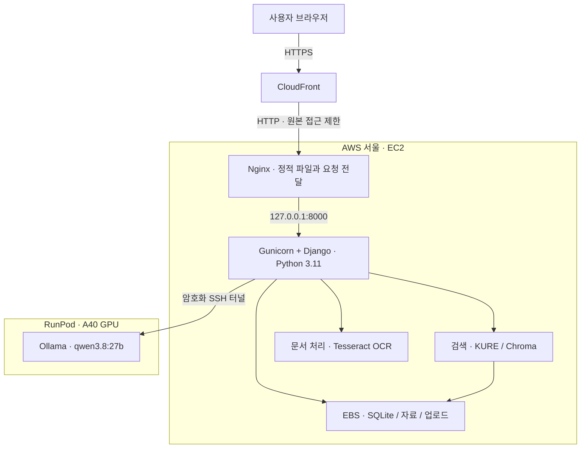

# LENS AWS·RunPod 배포 공유 문서

작성일: 2026-09-23 · 최초 기능 검증: 2026-09-22 · 검색 데이터 전환 검증: 2026-09-23

**최신 운영 상태 (2026-09-23):** 수정된 `patch060-r2-20260921` 데이터를 반영하여 EC2 검색 설정을 전환했습니다. 공개 HTTPS와 검색 준비 상태를 확인했습니다. 기존 RunPod SSH 연결은 실패하여 현재 AI 답변 생성은 검증하지 못했습니다. 사용자 요청에 따라 RunPod 재연결과 실제 생성 검증은 AWS 운영 설정 공유 이후의 별도 후속 작업으로 남깁니다.

이 문서는 실제로 수행한 배포를 정리한 팀 인수인계 자료입니다. 9월 22일의 전체 기능 검증과 9월 23일의 데이터 전환 검증을 구분해 기록합니다.

- 서비스: https://d3kro62a2qvg04.cloudfront.net/
- 소스 저장소: https://github.com/sji21/LENS_4th_project
- 현재 배포 커밋: `40ac9d706c4959ab14045349d47ecab55ad228a7` (최초 배포: `117445d7edbdc8a2678e005bc596fa877fdd80b6`)
- 구성: **EC2 + EBS + Elastic IP + Nginx + Gunicorn/Django + CloudFront + RunPod**
- 앱 실행 환경: **Python 3.11.16**

## 1. 팀에 설명할 때 사용할 요약

> 아래는 목표 요청 흐름이며 현재 RunPod 재연결은 후속 작업입니다. LENS의 웹 서버와 검색·OCR 기능은 AWS 서울 리전의 EC2에서 실행합니다. DB와 판례·검색 인덱스·업로드 파일은 EC2에 연결된 EBS에 저장합니다. 사용자는 CloudFront의 HTTPS 주소로 접속하고, Nginx와 Gunicorn을 거쳐 Django가 요청을 처리합니다. AI 답변 생성만 RunPod의 A40 GPU에서 Ollama와 Qwen 모델로 처리합니다. EC2와 RunPod는 SSH 터널로 연결했습니다. 서버 프로그램은 systemd로 실행하며, 이번 배포에는 Docker나 GitHub Actions를 적용하지 않았습니다.

## 2. 전체 구성과 요청 흐름



질문 하나가 처리되는 순서는 다음과 같습니다.

1. 브라우저가 CloudFront의 HTTPS 주소로 질문을 보냅니다.
2. CloudFront가 EC2의 Nginx로 전달하고, Nginx가 Django로 전달합니다.
3. Django가 질문과 첨부 문서를 처리하고 법령·민법·판례·가이드를 검색합니다.
4. 질문과 검색 근거를 SSH 터널을 통해 RunPod의 Ollama로 보냅니다.
5. Qwen이 답변을 생성하면 Django가 답변과 출처를 브라우저로 반환합니다.

**암호화 구간은 구분해야 합니다.** 브라우저→CloudFront는 HTTPS, EC2→RunPod는 SSH입니다. CloudFront→EC2는 HTTP이며 보안 그룹과 비밀 원본 헤더로 접근을 제한합니다. 모든 구간이 HTTPS인 구성은 아닙니다.

## 3. 각 서비스의 역할

| 구성 요소 | 역할 및 실제 설정 |
|---|---|
| EC2 | Ubuntu 24.04 서버. `m7i-flex.large`, 2 vCPU / 8 GB RAM |
| EBS | 암호화 gp3 60 GB. SQLite, 판례, 검색 인덱스, 업로드 파일 보관 |
| Elastic IP | EC2 공인 IP를 고정하여 재시작 후에도 동일 주소 사용 |
| CloudFront | 기본 `cloudfront.net` 주소와 HTTPS 제공. 이번 설정은 캐싱 비활성화 |
| Nginx | 정적 파일 제공, 요청을 Gunicorn으로 전달, 원본 비밀 헤더 검사 |
| Gunicorn | Django를 운영 서버 프로세스로 실행. 워커 1개·스레드 4개 |
| systemd | Django와 RunPod SSH 터널을 부팅 시 시작하고 장애 시 재시작 |
| RunPod | A40 48 GB GPU에서 생성 모델 실행 |
| Ollama | `0.34.2`, 모델 `qwen3.8:27b` / Q4_K_M |
| AWS Budget | 월 $30 초과 알림. 자동 중지나 지출 상한 기능은 아님 |

별도 도메인 구매나 Let’s Encrypt 인증서 발급 없이 CloudFront 기본 주소의 HTTPS를 사용했습니다. RDS·S3·ECR은 사용하지 않았고, 데이터는 EBS에 저장했습니다.

## 4. 실제 배포 순서

### ① 배포 대상 확인 및 소스 준비

AWS 계정을 `514644129560`, 리전을 서울 `ap-northeast-2`로 확인했습니다. 기존 교육용 AWS 프로필을 보존하고 배포용 CLI 프로필 `lens-deploy`를 사용했습니다. 원래 로컬 작업물을 건드리지 않도록 별도 Git 작업 폴더에서 배포 설정을 준비했습니다.

### ② EC2와 저장소·네트워크 구성

EC2 한 대에 암호화 EBS 60 GB를 연결하고 Elastic IP를 할당했습니다. EBS는 인스턴스 종료 시 자동 삭제하지 않도록 설정했습니다. 보안 그룹은 배포 PC의 SSH와 CloudFront 원본 IP 대역의 HTTP만 허용했습니다. Django 포트 8000은 인터넷에 직접 열지 않았습니다.

### ③ Python 3.11 앱 실행 환경 구성

EC2의 `/opt/lens/app`에 소스를 배치했습니다. Ubuntu의 시스템 Python은 그대로 두고, 별도 Python 3.11.16과 `/opt/lens/venv311` 가상환경을 만들었습니다. 기존 패키지 버전을 맞춰 설치하고 `pip check`로 의존성을 확인했습니다. GPU 추론은 RunPod가 담당하므로 EC2에는 CPU용 PyTorch를 설치했습니다.

### ④ 데이터와 검색 인덱스 준비

Git LFS로 대용량 판례 자료를 받고, KURE 모델을 내려받아 검색 인덱스를 구축했습니다. 판례 8,377건의 배포본 DB·원문 해시·인덱스 무결성을 확인하고 법령·민법·판례·가이드 검색을 검증했습니다. Python 환경 전환 시 기존 DB와 인덱스는 보존했습니다.

2026-09-23에는 수정된 로컬 `data/mysql-search/releases/patch060-r2-20260921`를 공용 MySQL의 세 스냅샷과 대조한 뒤 반영했습니다. 원문·청크·모델은 그대로 유지하고 현재 서버 코드·패키지 환경에 맞춰 기본·민법 인덱스를 다시 만들었습니다. 판례 인덱스는 검증 후 재사용했습니다. 검색 설정을 서버 전용 활성 포인터로 전환했고, 회원·대화용 SQLite는 유지했습니다. MySQL 변경은 자동 동기화되지 않으며 새 export와 검색 배포본 생성·활성화가 필요합니다.

일반 법령 185개 청크, 민법 31개 청크, 기관 안내 10개 청크, 판례 8,377건을 포함합니다. 판례 코퍼스의 전체 인덱스는 과거 법령·안내를 포함하여 8,516개 청크입니다. 원본과 같은 export·모델을 사용하지만 코드·라이브러리가 달라 검색 순위와 점수까지 완전히 같다는 뜻은 아닙니다.

### ⑤ Django 운영 설정 및 프로세스 등록

`config.production`을 추가하고 디버그 모드를 껐습니다. 허용 호스트, 보안 쿠키, CSRF 신뢰 주소와 프록시 HTTPS 처리를 설정했습니다. 비밀값은 서버의 `/etc/lens/lens.env`에 별도로 저장했습니다. DB 마이그레이션과 정적 파일 수집 후 Gunicorn을 `lens.service`로 등록했습니다.

### ⑥ Nginx와 CloudFront 연결

Nginx는 정적 파일을 제공하고 앱 요청은 `127.0.0.1:8000`으로 전달하도록 구성했습니다. CloudFront가 EC2를 원본으로 사용하도록 연결하고 HTTP 접속은 HTTPS로 이동시켰습니다. 개인화된 채팅·인증 응답이 캐시되지 않도록 CloudFront 캐싱을 비활성화했습니다.

### ⑦ RunPod에 모델 설치

사용자가 제공한 SSH 연결로 RunPod에 접속해 A40 GPU를 확인했습니다. `/workspace/lens`에 Ollama를 설치하고 `qwen3.8:27b`를 내려받았습니다. 모델 파일 검증을 마친 뒤 GPU 메모리에 실제 적재되는지 확인했습니다. Ollama는 `127.0.0.1:11434`에서만 수신하게 했습니다.

### ⑧ EC2와 RunPod를 SSH 터널로 연결

EC2에서 별도 터널용 키를 생성하고 RunPod에 공개 키를 등록했습니다. 키는 EC2 고정 IP와 Ollama 목적지 포트에 제한했으며, 해당 키로 셸 명령을 실행하지 못하도록 설정했습니다. 호스트 키를 확인해 고정하고 `lens-runpod-tunnel.service`를 등록했습니다.

앱 설정은 아래와 같습니다. 개인 SSH 비밀 키를 서버에 복사한 것은 아닙니다.

```dotenv
JEONSEON_LLM_BASE_URL=http://127.0.0.1:11434/v1
JEONSEON_LLM_MODEL=qwen3.8:27b
JEONSEON_LLM_TIMEOUT=90
```

여기의 `127.0.0.1`은 EC2 내부의 SSH 터널 입구입니다. 인터넷 구간은 SSH로 암호화됩니다. 앱의 실제 생성 요청은 설정된 주소를 정규화해 Ollama의 `/api/chat`으로 보냅니다.

### ⑨ 외부 접속 및 기능 검증

공개 HTTPS 주소에서 회원가입·로그인·로그아웃, PDF 처리, 한국어 이미지 OCR, 검색과 실제 AI 답변 생성을 확인했습니다. 테스트용 계정·문서는 정리하고 최종 익명 테스트 대화도 초기화했습니다.

## 5. 리소스 찾기와 서버 파일 위치

AWS 콘솔에서 리소스가 안 보이면 먼저 **계정과 리전**을 확인합니다. CloudFront는 전역 서비스입니다.

| 항목 | 식별 정보 |
|---|---|
| AWS 계정 / 리전 | `514644129560` / `ap-northeast-2` |
| EC2 | `i-091748b7dfcea398e` |
| Elastic IP | `54.116.179.166` |
| EBS | `vol-0adfa689791285be3` |
| 보안 그룹 | `sg-08f088a33a7ceb165` |
| CloudFront | `E1U82EYWALD05C` |
| RunPod | `by86qm78z4aszh` |

[서울 EC2 콘솔](https://ap-northeast-2.console.aws.amazon.com/ec2/home?region=ap-northeast-2#Instances:) · [CloudFront 콘솔](https://console.aws.amazon.com/cloudfront/v4/home)

| 서버 | 경로 | 내용 |
|---|---|---|
| EC2 | `/opt/lens/app` | 앱 소스 |
| EC2 | `/opt/lens/venv311` | Python 3.11 가상환경 |
| EC2 | `/etc/lens/lens.env` | 비밀 설정, 권한 0600 |
| EC2 | `/opt/lens/app/data` | DB·인덱스·업로드 등 영구 데이터 |
| EC2 | `/opt/lens/cache/huggingface` | 검색 모델 캐시 |
| EC2 | `/etc/lens/tunnel` | 터널 전용 키·고정 호스트 키 정보 |
| RunPod | `/workspace/lens/models` | Qwen 모델 파일 |
| RunPod | `/workspace/lens/logs/ollama.log` | Ollama 실행 로그 |

접속 권한과 비밀 키는 이 문서에 포함하지 않습니다. 팀원은 각자 승인된 계정·SSH 접근 권한으로 접속해야 합니다. 환경 파일이나 키 파일의 내용을 채팅·GitHub에 붙여 넣지 않습니다.

## 6. 운영 확인 명령

아래 명령은 **EC2에 접속한 뒤** 실행합니다.

```bash
# 웹 서버와 GPU 연결 상태
sudo systemctl status lens nginx lens-runpod-tunnel --no-pager

# Python과 패키지 의존성 확인
/opt/lens/venv311/bin/python --version
/opt/lens/venv311/bin/pip check

# 앱 로그와 SSH 터널 로그
sudo journalctl -u lens -n 50 --no-pager
sudo journalctl -u lens-runpod-tunnel -n 30 --no-pager

# RunPod 모델 설치·적재 상태
curl --fail http://127.0.0.1:11434/api/tags
curl --fail http://127.0.0.1:11434/api/ps
```

환경 설정을 변경한 경우 앱을 다시 시작합니다. 이때 검색 모델을 다시 적재하는 시간이 필요합니다.

```bash
sudo systemctl restart lens
```

GPU 연결만 복구하려면 터널을 다시 시작합니다.

```bash
sudo systemctl restart lens-runpod-tunnel
```

현재는 GitHub에 푸시해도 자동 배포되지 않습니다. 코드 갱신 시 배포할 커밋을 정하고 데이터·설정을 백업한 뒤 의존성 변경, 마이그레이션, 정적 파일 수집, 서비스 재시작과 기능 검증을 수행해야 합니다. 임베딩 모델이나 검색 코드가 바뀌면 인덱스 호환성도 확인해야 합니다.

## 7. 검증 결과와 현재 한계

**2026-09-23 데이터 전환:** MySQL 스냅샷 3개, 배포 파일 29개와 모델 해시, 서버 export 동일성, 4개 질문의 실제 검색 근거 본문·ID, 운영 프로세스 설정, 공개 HTTPS와 검색 준비 상태를 확인했습니다. RunPod SSH가 연결되지 않아 이번 데이터 기준 AI 생성은 미검증입니다. 아래 표는 이전 9월 22일 기록입니다.

활성 EC2 검색 release ID: `7993b603342b6c9da0f8c8cf6245e41c21eef61676df9de02328fe33bb73ca62`

| 검증 항목 | 2026-09-22 결과 |
|---|---|
| HTTPS·정적 파일·로그인·보안 쿠키 | 통과 |
| PDF 업로드·삭제 | 통과 |
| 한국어 PNG OCR·분류·삭제 | 통과 |
| 법령·민법·판례·가이드 검색 | 통과 |
| RunPod GPU 실제 생성 | 통과 |
| 터널 재시작 후 연결 복구 | 통과 |
| 전입신고 질문 | 약 22초, 답변·출처 반환 |
| 보증금 반환 질문 | 약 30초, 답변·출처 반환 |

이는 기능 연결 검증이며 동시 접속 부하 시험이나 법률 답변 품질 검증 전체를 완료한 것은 아닙니다. 보증금 반환 질문에서는 이사 전 확인할 절차에 관한 답변이 불완전했습니다. 검색 근거 선택과 답변 완결성은 추가 개선이 필요합니다.

CloudFront 원본 응답 대기 시간은 120초, LLM 단일 호출 제한은 90초입니다. 복잡한 질문이나 동시 접속 시 응답 지연을 확인해야 합니다. Gunicorn 워커는 검색 모델의 메모리 중복 적재를 줄이기 위해 1개로 설정했습니다.

## 8. 중지·재시작·비용 관리

AWS와 RunPod는 별도로 관리합니다. **EC2를 중지해도 RunPod GPU는 중지되지 않습니다.** EC2 중지 중에도 EBS와 Elastic IP 등의 보관 비용은 남습니다. AWS의 월 $30 예산 알림에는 RunPod 요금이 포함되지 않습니다.

EC2 중지·시작은 해당 계정에 인증된 PC에서 아래처럼 수행합니다. `lens-deploy`는 배포 PC의 프로필 이름이므로 팀원 PC에서는 자신의 프로필 이름으로 바꿉니다.

```powershell
# 웹 서비스 중지
aws ec2 stop-instances --profile lens-deploy --region ap-northeast-2 --instance-ids i-091748b7dfcea398e

# 웹 서비스 시작
aws ec2 start-instances --profile lens-deploy --region ap-northeast-2 --instance-ids i-091748b7dfcea398e
```

RunPod는 콘솔에서 별도로 중지·시작합니다. Pod 재배치 시 SSH IP·포트·호스트 키가 달라질 수 있으므로 새 정보를 확인하고 EC2 터널 설정을 갱신합니다. 새 컨테이너라면 시작 훅과 공개 키도 다시 설정해야 할 수 있습니다. `/workspace`의 보존 여부는 Pod 볼륨 설정에 따릅니다. 이번 배포에서는 실제 Pod 중지·재배치 시험은 하지 않았습니다. 현재는 기존 SSH 주소로 연결되지 않아 새 접속 정보가 필요합니다.

2026-09-23 정기 백업을 추가했습니다. DLM 정책 `policy-0d5e3ce7bcdd03093`이 매일 한국시간 03:00 기준 EBS 스냅샷을 만들고 최근 7개를 보관합니다. 02:30에는 SQLite Backup API로 무결성이 확인된 DB 사본을 만듭니다. 별도 수동 배포 전 스냅샷은 `snap-0f68fc92c4a71dd78`이며 자동 삭제되지 않습니다. 스냅샷 저장 비용은 추가됩니다. 자세한 복구 범위·제한은 [BACKUP.md](../../deploy/aws/BACKUP.md)를 참고하세요.

EBS의 종료 시 자동 삭제를 꺼 둔 것은 백업을 만든 것과 다릅니다. 서버 교체 전에는 DB·사용자 파일·검색 자료와 별도로 보관하는 파일 암호화 키를 함께 백업해야 합니다. SQLite 백업은 쓰기를 중지하거나 SQLite 백업 기능을 사용해 일관성을 유지합니다.

## 9. 설정 파일 인수인계

이 변경안에는 이 문서와 실제 배포에 사용한 `config/production.py`, `deploy/aws` 설정·스크립트가 포함됩니다. SSH 비밀 키, `.env`, 원본 헤더 비밀값, 사용자 데이터는 포함하지 않습니다.

서버에 반영한 운영 설정을 `codex/patch-066-aws-operations` 브랜치에서 PATCH-066으로 공유합니다. PR이 병합되기 전에는 이 브랜치를 명시적으로 받아야 합니다. 이 PR의 커밋·푸시는 자동 배포를 실행하지 않으며, 기존 서버의 앱 기준 커밋은 위에 기록한 `40ac9d7`입니다. 운영 설정은 서버에 별도로 설치된 상태입니다. GitHub 밖에서 인계할 데이터와 접속 권한은 [별도 인수인계 안내](ACCESS-HANDOFF.md)를 따릅니다.

스크립트는 기존 서버의 경로·계정·리소스를 전제로 한 참고 자료이며, 새 AWS 계정에서 바로 실행하는 완전 자동 구축 도구가 아닙니다. 새 환경에서는 리소스 ID·주소·호스트 키·서비스 계정과 사전 준비 단계를 검토해야 합니다. 최종 구성은 이 문서 및 `README.md`, `MYSQL-SEARCH.md`, `RUNPOD.md`를 기준으로 봅니다.


## 10. 2026-09-23 운영 보완

- GitHub 최신 `40ac9d7`의 달력 선택·대화방 삭제 UI 반영, 관련 테스트 31개 통과.
- 검색 release와 Python 3.11 유지, 검색 manifest 재검증 통과.
- SQLite 백업의 WAL·실패 복구·원본 보호 테스트 3개 통과.
- EBS 정기 정책과 DB 백업 타이머 활성화.
- 비밀값 없는 운영 설정·백업 도구·인수인계 문서를 PATCH-066 PR 범위로 정리함.
- RunPod 재연결·실제 GPU 답변 검증은 사용자 요청에 따라 별도 후속 작업으로 남김.
